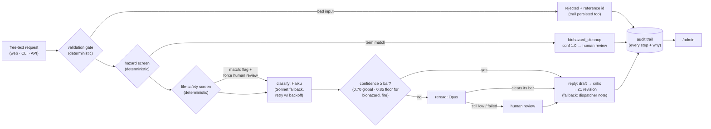
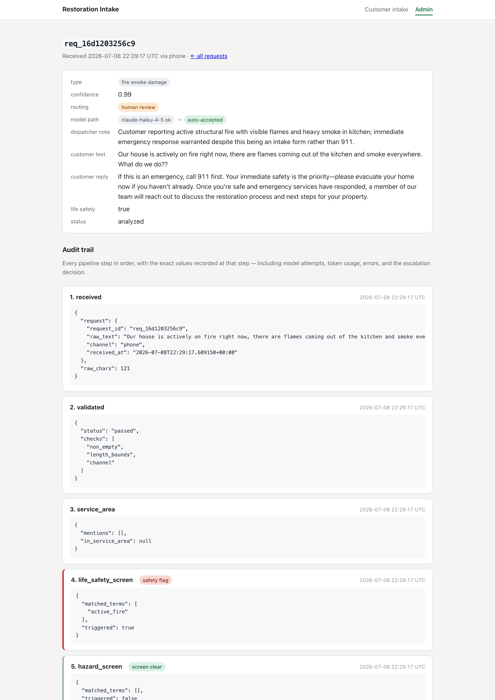

# Restoration Intake Agent

[](https://github.com/aeicher5/restoration-intake-agent/actions/workflows/ci.yml)

<!-- TODO: build timelapse gif (docs/build-timelapse.gif) -->

An end-to-end AI intake agent for a restoration-services company. A customer
writes in plain text ("our basement flooded overnight and I'm worried about
mold") and the system validates the request, classifies it, checks the model's
confidence, escalates to a human when warranted, and records an audit trail of
every decision. There's a customer intake page on the front and an admin view
over the trail on the back.

It started as a one-hour live build, then got extended the same evening by
three Claude Code agents working in parallel git worktrees.
[ARCHITECTURE.md](ARCHITECTURE.md) covers the system design and what changes
at production scale.

## Start here

Two things worth reading before the code:

- The regression story. The first hour deliberately shipped a bug: "nuclear
  material has spilled all over our yard" got a confident wrong read that
  sailed past every confidence gate. How it was fixed at the deterministic
  layer is in [evals/README.md → Known failing](evals/README.md#known-failing).
- Why safety routing is code, not model. The confidence gate catches "I'm not
  sure"; it can't catch confidently wrong. That's why hazmat routing runs as
  deterministic code ahead of any model call:
  [ARCHITECTURE.md → Design decisions](ARCHITECTURE.md#design-decisions).

## The pipeline at a glance




*The admin detail view for one request: validation, hazard screen, model
attempts with token usage, the confidence gate, and where it ended up.*

## Quickstart

```bash
pip install anthropic            # agent.py's only dependency

python3 agent.py --selftest      # offline: no API key, no network (fake client)

echo "ANTHROPIC_API_KEY=<your key>" > .env    # .env is gitignored; don't commit it

python3 agent.py "There is standing water in our basement"   # one live request
python3 agent.py --evals                       # built-in labeled suite, live (12 cases)
python3 evals/run_extended.py                  # extended suite, live (19 cases)
python3 evals/run_extended.py --check          # schema/scorer check, offline
```

### Web UI (customer intake + admin)

```bash
pip install -r requirements.txt
python3 demo.py           # seed the admin view: 5 archetypal requests through the live pipeline
python3 web.py            # http://localhost:8080 — intake at /, audit trail at /admin,
                          # dispatcher work queue at /admin/queue
```

All the env vars are optional; the defaults are meant for localhost:

- `PORT` overrides the port (`INTAKE_WEB_PORT` still works).
- `ADMIN_TOKEN`: set it and the admin views (including the dispatcher queue
  and its actions) require auth. Visit `/admin?token=<value>` once and an
  HttpOnly cookie takes over. The token is redacted from access logs. Unset
  means open, which is for local use only.
- `INTAKE_RATE_BURST` / `INTAKE_RATE_PER_MINUTE`: per-IP rate limit on
  `POST /`. Defaults are burst 5 and 6/min; over the limit gets a 429 with
  `Retry-After`.

For a real deploy, see [DEPLOY.md](DEPLOY.md). Railway config-as-code is
included, and Render is documented as the fallback.

### Docker

```bash
docker build -t restoration-intake .
docker run --rm restoration-intake             # runs the offline selftest
```

## Layout

| Path | Purpose |
|---|---|
| `agent.py` | The pipeline: validate → hazard and life-safety screens → classify (Haiku, Sonnet fallback, Opus reread) → confidence gate → reply → audit trail. Selftest, evals, and a stdlib dev server included. |
| `web.py`, `templates/` | FastAPI web layer plus the append-only JSONL audit persistence. |
| `escalations.py` | The escalation workflow (open → acknowledged → resolved), folded from audit events. Powers `/admin/queue`. |
| `demo.py` | Seeds the admin view: 5 archetypal requests through the live pipeline. |
| `evals/` | Extended eval suite, runner, correction ingest, and live results. See [evals/README.md](evals/README.md). |
| `Dockerfile` | python-slim image, selftest as the default CMD. |
| `.github/workflows/` | `ci.yml` runs the offline suite on every push, zero secrets. `promotion-gate.yml` re-runs the live suite before prompt or eval changes land. |
| `railway.toml`, `DEPLOY.md` | Config-as-code deploy plus the step-by-step guide. |
| `ARCHITECTURE.md` | How the system works and what changes at scale. |
| `playbook/` | The parallel-agent build motion, written up so any team can reuse it. |

Where it goes next: [ROADMAP.md](ROADMAP.md). That's the list of things
deliberately not built yet (event-store spine, multi-tenancy, PII and
retention, SSO and roles), each written as a brief the next session could pick
up and run.
