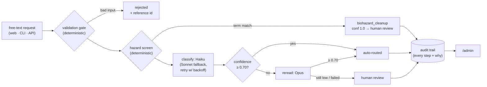

# Restoration Intake Agent

<!-- ship-time slots (add the file, then the reference — never reference a file that doesn't exist):
     1. CI badge markdown here (from infra handoff) once .github workflow is merged
     2.  if the gif lands -->

An end-to-end AI intake agent for a restoration-services company. A customer
writes in plain text ("our basement flooded overnight and I'm worried about
mold") and the system validates, classifies, confidence-checks, escalates to a
human when warranted, and records an audit trail of every decision — plus a
customer intake page and an admin view over that trail.

Started as a **one-hour live build**, then extended the same evening by
**three Claude Code agents working in parallel git worktrees**. The build
method is documented in [ORCHESTRATION.md](ORCHESTRATION.md); the system
design and its path to production scale in [ARCHITECTURE.md](ARCHITECTURE.md).

## Start here

- **The regression story** — the bug deliberately left in after the first hour
  (*"nuclear material has spilled all over our yard"* → a **confident** wrong read that
  sailed past every confidence gate) and how it was killed at the deterministic layer:
  [evals/README.md → Known failing](evals/README.md#known-failing).
- **How it was built** — three parallel agents, disjoint file lanes, zero merge
  conflicts, one evening: [ORCHESTRATION.md](ORCHESTRATION.md).
- **The doctrine** — *escalation protects against uncertainty, not miscalibration*;
  that's why safety-critical routing is deterministic code ahead of any model call:
  [ARCHITECTURE.md → Design principles](ARCHITECTURE.md#design-principles-locked-in-the-original-build-kept-tonight).

## The pipeline at a glance




*The admin detail view: one request's full audit trail — validation, hazard screen,
model attempts with token usage, the confidence gate, and where it ended up.*

## Quickstart

```bash
pip install anthropic            # agent.py's only dependency

python3 agent.py --selftest      # offline — no API key, no network (fake client)

echo "ANTHROPIC_API_KEY=<your key>" > .env    # .env is gitignored; never commit it

python3 agent.py "There is standing water in our basement"   # one request, live
python3 agent.py --evals                       # built-in labeled suite, live (12 cases)
python3 evals/run_extended.py                  # extended suite, live (15 cases)
python3 evals/run_extended.py --check          # extended suite schema/scorer check, offline
```

### Web UI (customer intake + admin audit view)

```bash
pip install -r requirements.txt
python3 demo.py           # seed the admin view: 5 archetypal requests through the live pipeline
python3 web.py            # http://localhost:8080 — intake at /, audit trail at /admin
```

### Docker

```bash
docker build -t restoration-intake .
docker run --rm restoration-intake             # runs the offline selftest
```

## Layout

| Path | Purpose |
|---|---|
| `agent.py` | The pipeline: validation → hazard screen → LLM classification (Haiku, Sonnet fallback, Opus reread) → escalation → audit trail. Selftest, evals, and a stdlib dev server included |
| `web.py`, `templates/` | FastAPI web layer + JSONL audit persistence |
| `demo.py` | Seed the admin view: 5 archetypal requests through the live pipeline |
| `evals/` | Extended eval suite, runner, and live results ([evals/README.md](evals/README.md)) |
| `Dockerfile` | python-slim image, selftest as default CMD |
| `ARCHITECTURE.md` | How the system works and what changes at scale |
| `ORCHESTRATION.md` | How three parallel agents built this in an evening |
