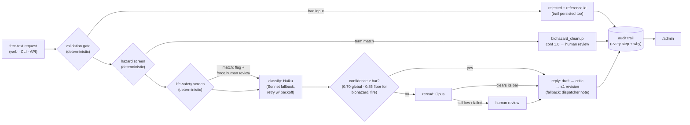

# Restoration Intake Agent

[](https://github.com/aeicher5/restoration-intake-agent/actions/workflows/ci.yml)

<!-- ship-time slot:  if the gif lands
     (never reference a file that doesn't exist) -->

An end-to-end AI intake agent for a restoration-services company. A customer
writes in plain text ("our basement flooded overnight and I'm worried about
mold") and the system validates, classifies, confidence-checks, escalates to a
human when warranted, and records an audit trail of every decision — plus a
customer intake page and an admin view over that trail.

Started as a **one-hour live build**, then extended by **three Claude Code
agents working in parallel git worktrees**. The system design and its path to
production scale are in [ARCHITECTURE.md](ARCHITECTURE.md).

## Start here

- **The doctrine** — *escalation protects against uncertainty, not miscalibration*;
  that's why safety-critical routing is deterministic code ahead of any model call:
  [ARCHITECTURE.md → Design decisions](ARCHITECTURE.md#design-decisions).

## The pipeline at a glance




*The admin detail view: one request's full audit trail — validation, hazard screen,
model attempts with token usage, the confidence gate, and where it ended up.*

## Quickstart

```bash
pip install anthropic            # agent.py's only dependency

python3 agent.py --selftest      # offline — no API key, no network (fake client)

echo "ANTHROPIC_API_KEY=<your key>" > .env    # .env is gitignored; never commit it

python3 agent.py "There is standing water in our basement"   # one request, live
python3 agent.py --evals                       # built-in labeled suite, live (12 cases)
python3 evals/run_extended.py                  # extended suite, live (19 cases)
python3 evals/run_extended.py --check          # extended suite schema/scorer check, offline
```

### Web UI (customer intake + admin audit view)

```bash
pip install -r requirements.txt
python3 demo.py           # seed the admin view: 5 archetypal requests through the live pipeline
python3 web.py            # http://localhost:8080 — intake at /, audit trail at /admin,
                          # dispatcher work queue at /admin/queue
```

Ops knobs (all optional; defaults are the localhost posture):

- `PORT` — platform-style port override (`INTAKE_WEB_PORT` still honored).
- `ADMIN_TOKEN` — set it and the admin views (including the dispatcher queue
  at `/admin/queue` and its actions) require auth: visit `/admin?token=<value>`
  once, then an HttpOnly cookie takes over. The token is redacted from access
  logs. Unset = open, for local use only.
- `INTAKE_RATE_BURST` / `INTAKE_RATE_PER_MINUTE` — per-IP rate limit on
  `POST /` (defaults: burst 5, 6/min; excess gets 429 + `Retry-After`).

Deploying for real: see [DEPLOY.md](DEPLOY.md) (Railway config-as-code
included, Render fallback documented).

### Docker

```bash
docker build -t restoration-intake .
docker run --rm restoration-intake             # runs the offline selftest
```

## Layout

| Path | Purpose |
|---|---|
| `agent.py` | The pipeline: validation → hazard screen → LLM classification (Haiku, Sonnet fallback, Opus reread) → escalation → audit trail. Selftest, evals, and a stdlib dev server included |
| `web.py`, `templates/` | FastAPI web layer + JSONL audit persistence |
| `escalations.py` | Escalation workflow: open → acknowledged → resolved, folded from audit events; powers `/admin/queue` |
| `demo.py` | Seed the admin view: 5 archetypal requests through the live pipeline |
| `evals/` | Extended eval suite, runner, correction ingest, and live results ([evals/README.md](evals/README.md)) |
| `Dockerfile` | python-slim image, selftest as default CMD |
| `.github/workflows/` | `ci.yml`: offline CI on every push — zero secrets. `promotion-gate.yml`: prompt/eval changes re-run the live suite before judgment-affecting changes land |
| `railway.toml`, `DEPLOY.md` | Config-as-code deploy + step-by-step deploy guide |
| `ARCHITECTURE.md` | How the system works and what changes at scale |
| `playbook/` | The parallel-agent build motion, made reusable for any team |

**Where this goes next:** [ROADMAP.md](ROADMAP.md) — the deliberately-not-yet list (event-store spine, multi-tenancy, PII/retention, SSO/roles), written as ready-to-run briefs.
